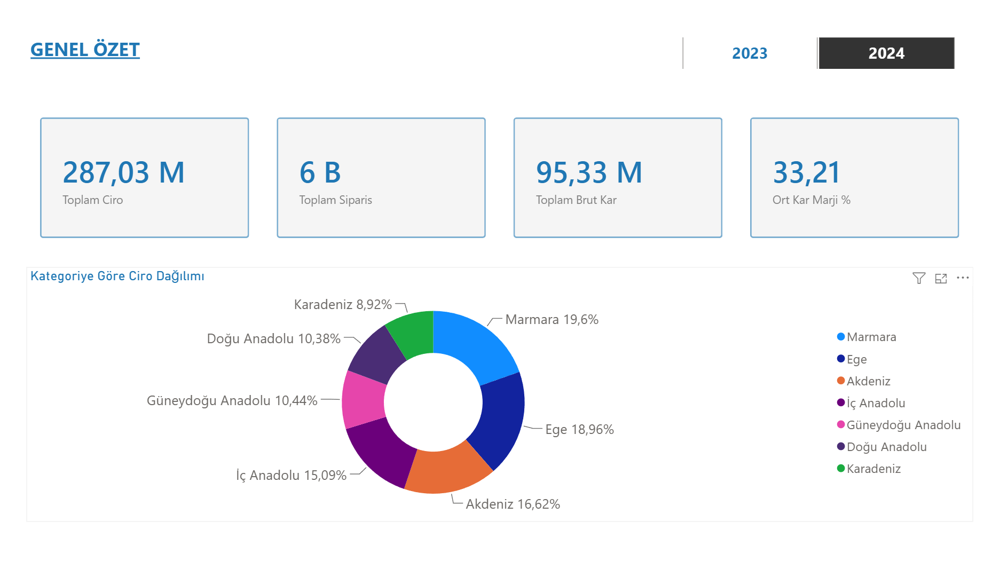
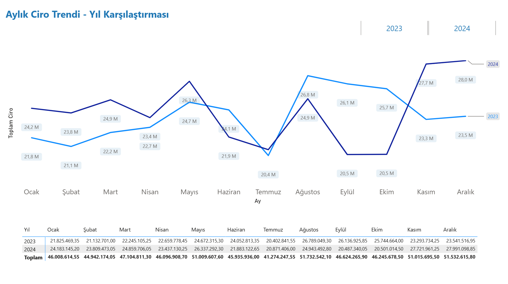
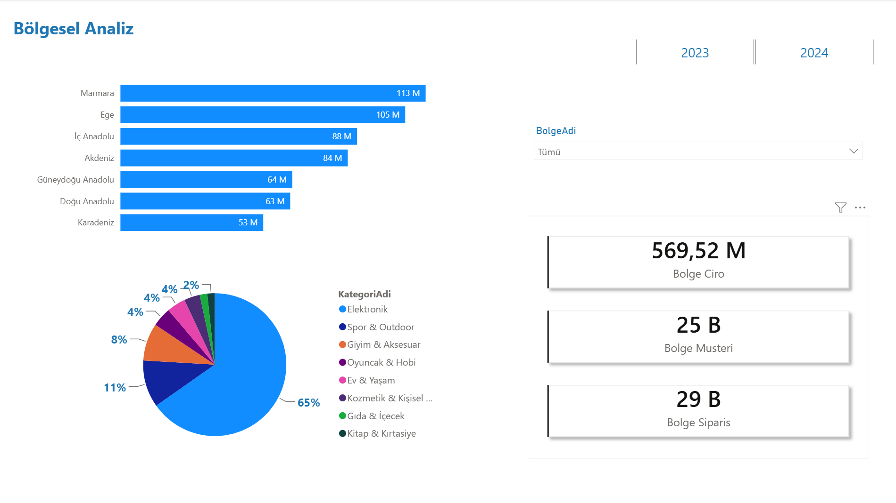
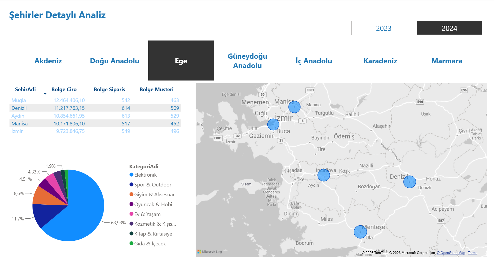
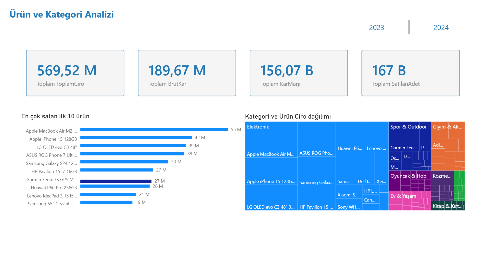

# Perakende Satış BI Projesi

Bu proje, bir perakende şirketinin satış verilerini SQL Server'da modelleyip Power BI ile görselleştiren uçtan uca bir İş Zekâsı (BI) çalışmasıdır. Veritabanı tasarımından raporlamaya kadar her adım belgelenmiştir.

---

## Proje Hakkında

### Veri Seti

Veritabanı ve içindeki örnek veri, **Claude (Anthropic)** yapay zekâ asistanı tarafından oluşturulmuştur. Gerçekçi bir perakende senaryosu kurgulanmış; tablolar, ilişkiler ve binlerce satır örnek kayıt Claude ile birlikte tasarlanmıştır.

Veri seti **2023–2024** dönemini kapsar ve şunları içerir:

- 5 satış bölgesi, 20'den fazla şehir
- 5 ürün kategorisi (Elektronik, Giyim, Gıda, Ev & Yaşam, Kırtasiye), 50'den fazla ürün
- 200'den fazla müşteri (Kurumsal, KOBİ, Bireysel segmentleri)
- Birden fazla bölgede çalışan satış temsilcileri ve yıllık hedefleri
- Binlerce sipariş ve sipariş detay kaydı

### Sorgular Neyi Görmek İçin Yazıldı?

SQL sorguları ve view'lar dört temel soruya yanıt aramak amacıyla oluşturuldu:

| Analiz Alanı | Hedef |
|---|---|
| **Satış Trendi** | Aylık ve yıllık ciro nasıl seyretti? Bir önceki aya göre büyüme var mı? |
| **Bölgesel Performans** | Hangi bölge ve şehirler en çok ciro üretiyor? Bölgeler arası pay nedir? |
| **Ürün & Kategori** | Hangi ürünler en çok satıldı, en yüksek kârı getirdi? Kategori bazlı dağılım nedir? |
| **Temsilci Performansı** | Satış temsilcileri yıllık hedeflerinin ne kadarını gerçekleştirdi? Bölge içi sıralamaları nedir? |
| **Müşteri Segmentasyonu** | RFM analizi ile hangi müşteriler "Şampiyon", hangileri "Risk Altında" veya "Kaybedilen" segmentinde? |

### Görselleştirmeler

Power BI raporu 6 sayfadan oluşmaktadır. Her sayfa yukarıdaki analiz alanlarından birine karşılık gelir:

- **Genel Özet** — KPI kartları, toplam ciro, kâr ve sipariş sayısı
- **Satış Trendi** — Aylık ciro çizgi grafiği ve büyüme oranları
- **Bölgesel Analiz** — Bölge bazlı kart görünümü ve karşılaştırmalı çubuk grafik
- **Şehirler Detaylı** — Şehir kırılımında tablo ve sıralama
- **Ürün & Kategori** — En çok satan ürünler, kategori pasta grafiği
- **Temsilci Performansı** — Hedef gerçekleşme oranları ve bölge içi sıralama

---

## Kullanılan Teknolojiler

- Microsoft SQL Server 2019+
- T-SQL
- Power BI Desktop
- SQL Server Reporting Services (SSRS)

---

## 1. Veritabanı Nasıl Oluşturuldu?

**Dosya:** `sql/01_veritabani.sql`

SQL Server'da her şey bir veritabanı içinde tutulur. Veritabanı oluşturmak için `CREATE DATABASE` komutu kullanılır.

```sql
CREATE DATABASE PerakendeSatisDB
    COLLATE Turkish_CI_AS;
```

Burada `COLLATE Turkish_CI_AS` ifadesi, veritabanının Türkçe karakterleri (ş, ğ, ü, ö, ç, ı) doğru şekilde saklamasını ve sıralamasını sağlar. Bunu belirtmezsek Türkçe karakterler bozulabilir.

Scriptin başında şu blok da yer alır:

```sql
IF EXISTS (SELECT name FROM sys.databases WHERE name = 'PerakendeSatisDB')
BEGIN
    DROP DATABASE PerakendeSatisDB;
END
```

Bu blok şunu yapar: Eğer bu isimde bir veritabanı zaten varsa önce siler, sonra yeniden oluşturur. `IF EXISTS` ile kontrol etmeden silmeye kalkarsak veritabanı yoksa hata alırız. Bu yüzden önce "var mı?" diye sorup sonra siliyoruz.

---

## 2. Tablolar Nasıl Oluşturuldu?

**Dosya:** `sql/02_tablolar.sql`

Veritabanı oluşturduktan sonra içine tablo ekleriz. Tablolar `CREATE TABLE` komutuyla yapılır. Her kolonun adı ve veri tipi belirtilir.

### Veri Tipleri

Projede kullandığımız başlıca veri tipleri:

| Tip | Ne İşe Yarar | Örnek |
|-----|-------------|-------|
| `INT` | Tam sayı | ID'ler, miktar |
| `NVARCHAR(n)` | Türkçe metin (en fazla n karakter) | İsimler, kodlar |
| `DECIMAL(10,2)` | Ondalıklı sayı (10 basamak, 2 ondalık) | Fiyat, maliyet |
| `DATE` | Tarih (yıl-ay-gün) | Kayıt tarihi |
| `DATETIME` | Tarih + saat | Sipariş zamanı |
| `BIT` | Evet/Hayır (1/0) | AktifMi |

### PRIMARY KEY ve IDENTITY

Her tabloda bir `PRIMARY KEY` kolonu vardır. Bu, her satırın birbirinden farklı olmasını garanti eder. `IDENTITY(1,1)` ise bu numarayı otomatik olarak 1'den başlatıp her yeni kayıtta 1 artırır — elle girmemize gerek kalmaz.

```sql
CREATE TABLE Kategoriler (
    KategoriID  INT           IDENTITY(1,1) PRIMARY KEY,
    KategoriAdi NVARCHAR(100) NOT NULL
);
```

`NOT NULL` ifadesi, o kolonun boş bırakılamayacağını söyler.

### FOREIGN KEY (Tablo İlişkileri)

Tablolar arasındaki bağlantıyı `FOREIGN KEY` ile kurarız. Örneğin bir şehrin hangi bölgeye ait olduğunu şöyle belirtiriz:

```sql
CREATE TABLE Sehirler (
    SehirID  INT          IDENTITY(1,1) PRIMARY KEY,
    SehirAdi NVARCHAR(50) NOT NULL,
    BolgeID  INT          NOT NULL,
    CONSTRAINT FK_Sehirler_Bolgeler
        FOREIGN KEY (BolgeID) REFERENCES Bolgeler(BolgeID)
);
```

`REFERENCES Bolgeler(BolgeID)` ifadesi şunu söyler: "Bu kolona yazılan değer, Bolgeler tablosundaki BolgeID'de mutlaka bulunmalı." Böylece var olmayan bir bölgeye şehir atanamaz.

### CHECK Kısıtları

Bir kolona yalnızca belirli değerlerin girilebilmesini istiyorsak `CHECK` kullanırız:

```sql
CONSTRAINT CHK_Musteriler_Segment
    CHECK (Segment IN ('Kurumsal', 'KOBİ', 'Bireysel'))
```

Bu kısıt, Segment alanına sadece bu üç değerin girilmesine izin verir. Yanlış bir değer girilmeye çalışılırsa SQL Server hata verir.

### UNIQUE Kısıtı

Bir kolondaki değerlerin tekrar etmemesini istiyorsak `UNIQUE` kullanırız:

```sql
CONSTRAINT UQ_Urunler_UrunKodu UNIQUE (UrunKodu)
```

Böylece iki ürün aynı kodu taşıyamaz.

### Oluşturulan Tablolar

| Tablo | Ne Tutar |
|-------|----------|
| `Bolgeler` | Satış bölgelerinin listesi |
| `Sehirler` | Şehirler ve hangi bölgede oldukları |
| `Kategoriler` | Ürün kategorileri |
| `Urunler` | Ürün bilgileri, fiyat ve maliyet |
| `Musteriler` | Müşteri bilgileri ve segmenti |
| `SatisTemsilcileri` | Temsilciler ve yıllık hedefleri |
| `Siparisler` | Sipariş başlıkları (kim, ne zaman, hangi temsilci) |
| `SiparisDetay` | Siparişlerin satır detayı (hangi ürün, kaç adet, iskonto) |

### İlişki Şeması

```
Bolgeler ──< Sehirler ──< Musteriler ──< Siparisler ──< SiparisDetay >── Urunler >── Kategoriler
                    SatisTemsilcileri ──────────────< Siparisler
```

### İndeksler

Tablolar üzerinde sık sorgulanan kolonlara `NONCLUSTERED INDEX` eklendi. İndeks, kitabın arkasındaki dizin gibi çalışır — SQL Server'ın tüm tabloyu taramak yerine doğrudan ilgili satıra gitmesini sağlar. Bu sorgu hızını önemli ölçüde artırır.

```sql
CREATE NONCLUSTERED INDEX IX_Siparisler_SiparisTarihi
    ON Siparisler (SiparisTarihi)
    INCLUDE (MusteriID, TemsilciID, Durum);
```

`INCLUDE` ile eklenen kolonlar indeks üzerinde taşınır; bu sayede sorgu sonucu için tabloya geri dönülmesi gerekmez.

---

## 3. Örnek Veri

**Dosya:** `sql/03_ornek_veri.sql`

Tablolara `INSERT INTO` komutuyla veri eklenir:

```sql
INSERT INTO Kategoriler (KategoriAdi)
VALUES ('Elektronik'), ('Giyim'), ('Gıda'), ('Ev & Yaşam'), ('Kırtasiye');
```

Proje 2023–2024 dönemini kapsar: 5 bölge, 20+ şehir, 50+ ürün, 200+ müşteri ve binlerce sipariş kaydı içerir.

---

## 4. View'lar

**Dosya:** `sql/04_views.sql`

View, kayıtlı bir `SELECT` sorgusudur. Karmaşık JOIN ve hesaplamalar view içine yazılır; Power BI veya başka bir araç onu sanki bir tablo gibi sorgular.

`CREATE OR ALTER VIEW` komutu kullanılır — bu sayede view zaten varsa güncellenir, yoksa oluşturulur.

### JOIN Mantığı

Birden fazla tablodan veri çekmek için `JOIN` kullanırız. `INNER JOIN`, her iki tabloda da eşleşen kayıtları getirir:

```sql
FROM Siparisler s
INNER JOIN SiparisDetay sd ON s.SiparisID = sd.SiparisID
INNER JOIN Urunler      u  ON sd.UrunID   = u.UrunID
```

### Hesaplanan Kolonlar

View'larda ciro, kar ve iskonto gibi değerler formülle hesaplanır:

```sql
-- Net ciro (iskonto düşüldükten sonra)
SUM(sd.Miktar * sd.BirimFiyat * (1 - sd.IskontoOrani / 100.0)) AS ToplamCiro

-- Brüt kar (satış fiyatı eksi maliyet)
SUM(sd.Miktar * (sd.BirimFiyat * (1 - sd.IskontoOrani / 100.0) - u.Maliyet)) AS BrutKar

-- Kar marjı yüzdesi
BrutKar / NULLIF(ToplamCiro, 0) * 100 AS KarMarji
```

`NULLIF(ToplamCiro, 0)` kullanımına dikkat: Eğer ciro sıfırsa sıfıra bölme hatası alırız. `NULLIF` bu durumda sıfır yerine NULL döndürür ve bölme işlemi hata vermez.

### GROUP BY

Satır satır veriden özet elde etmek için `GROUP BY` kullanılır. Örneğin her ay için toplam ciro:

```sql
SELECT
    YEAR(s.SiparisTarihi)  AS Yil,
    MONTH(s.SiparisTarihi) AS Ay,
    SUM(...)               AS ToplamCiro
FROM Siparisler s
...
GROUP BY YEAR(s.SiparisTarihi), MONTH(s.SiparisTarihi)
```

### Oluşturulan View'lar

| View | Power BI Sayfası | Ne Döndürür |
|------|-----------------|-------------|
| `VW_AylikSatisOzeti` | Genel Özet, Satış Trendi | Aylık ciro, kar, sipariş özeti |
| `VW_UrunPerformans` | Ürün & Kategori | Ürün ve kategori bazlı satış |
| `VW_TemsilciPerformans` | Temsilci Performansı | Temsilci bazlı ciro ve hedef |
| `VW_MusteriSegmentleri` | Müşteri Analizi | RFM skorları ve segmentler |
| `VW_BolgeselSatis` | Bölgesel Analiz, Şehirler | Bölge ve şehir bazlı satış |

---

## 5. Stored Procedure'lar

**Klasör:** `sql/stored_procedures/`

Stored Procedure (SP), SQL Server'da saklanan ve ismiyle çağrılabilen bir sorgu bloğudur. View'dan farkı, parametre alabilmesidir — yani "2024 yılını getir" veya "sadece İstanbul'u getir" gibi çağrılar yapılabilir.

`CREATE OR ALTER PROCEDURE` ile oluşturulur, `EXEC` ile çalıştırılır.

### `SP_AylikSatisOzeti`

Yıl ve ay aralığı filtresiyle aylık satış özetini döndürür.

```sql
EXEC SP_AylikSatisOzeti @Yil = 2024, @AyBaslangic = 1, @AyBitis = 6;
```

Bu SP'de `LAG()` window function kullanılır. `LAG()`, bir önceki satırın değerini getirir — bu sayede her ay için bir önceki aya göre büyüme oranı hesaplanır:

```sql
LAG(SUM(ToplamCiro), 1) OVER (ORDER BY Yil, Ay)
```

`OVER (ORDER BY ...)` ifadesi, `LAG()`'in hangi sıraya göre çalışacağını belirler.

### `SP_BolgeselSatisAnalizi`

Bölge, şehir ve kategori kırılımında satış analizi yapar. Bir şehrin hem kendi bölgesi içindeki hem de genel toplamdaki ciro payını hesaplar:

```sql
-- Bölge içindeki pay
SUM(ToplamCiro) OVER (PARTITION BY BolgeAdi)

-- Genel toplam
SUM(ToplamCiro) OVER ()
```

`PARTITION BY` ifadesi hesabı bölge bölge yapar. `OVER ()` içi boş bırakıldığında ise tüm satırlar üzerinden toplam alır.

```sql
EXEC SP_BolgeselSatisAnalizi @Yil = 2024;
```

### `SP_EnCokSatanUrunler`

Top-N en çok satan ürünleri miktar, ciro veya kara göre sıralar. Aynı anda üç farklı sıralama `RANK()` ile hesaplanır:

```sql
RANK() OVER (ORDER BY ToplamSatisMiktari DESC) AS MiktarSirasi,
RANK() OVER (ORDER BY ToplamCiro DESC)         AS CiroSirasi,
RANK() OVER (ORDER BY ToplamBrutKar DESC)      AS KarSirasi
```

`RANK()` bir window function'dır; her satıra eşdeğer satırlar aynı sıra numarasını alır.

```sql
EXEC SP_EnCokSatanUrunler @TopN = 10, @KategoriID = 1;
```

### `SP_MusteriSegmentasyonu`

Müşterileri RFM yöntemiyle segmentlere ayırır. RFM üç soruya yanıt arar:

- **Recency:** Müşteri en son ne zaman alışveriş yaptı? (az gün önce = iyi)
- **Frequency:** Kaç kez alışveriş yaptı? (çok = iyi)
- **Monetary:** Ne kadar harcadı? (yüksek = iyi)

Her boyut `NTILE(5)` ile 1–5 arası skorlanır. `NTILE(5)` tüm müşterileri sıralayıp 5 eşit gruba böler:

```sql
NTILE(5) OVER (ORDER BY Recency  ASC)  AS R_Skor,
NTILE(5) OVER (ORDER BY Frequency DESC) AS F_Skor,
NTILE(5) OVER (ORDER BY Monetary  DESC) AS M_Skor
```

Skorlar toplandıktan sonra `CASE WHEN` ile her müşteriye bir segment etiketi atanır:

```sql
CASE
    WHEN R_Skor >= 4 AND F_Skor >= 4 AND M_Skor >= 4 THEN 'Şampiyon'
    WHEN R_Skor <= 2 AND F_Skor >= 4 AND M_Skor >= 4 THEN 'Risk Altında'
    WHEN R_Skor = 1  AND F_Skor = 1                   THEN 'Kaybedilen'
    ...
END AS RFMSegmenti
```

```sql
EXEC SP_MusteriSegmentasyonu @AnalizTarihi = '2024-12-31';
```

### `SP_TemsilciPerformans`

Her temsilcinin hedefine ne kadar yaklaştığını gösterir. Hem genel sıralama hem de bölge içi sıralama hesaplanır:

```sql
RANK() OVER (ORDER BY GerceklesenCiro DESC)                       AS PerformansSirasi,
RANK() OVER (PARTITION BY BolgeAdi ORDER BY GerceklesenCiro DESC) AS BolgeSirasi
```

Performans durumu `CASE WHEN` ile otomatik etiketlenir:

```sql
CASE
    WHEN GerceklesenCiro / YillikHedef >= 1.00 THEN 'Hedef Aşıldı'
    WHEN GerceklesenCiro / YillikHedef >= 0.90 THEN 'Hedefe Yakın'
    WHEN GerceklesenCiro / YillikHedef >= 0.70 THEN 'Geliştirilmeli'
    ELSE 'Hedef Altı'
END AS PerformansDurumu
```

```sql
EXEC SP_TemsilciPerformans @Yil = 2024;
```

---

## 6. Power BI Raporu

**Dosya:** `powerbi/rapor.pbix`

SQL Server'daki view'lar Power BI'a bağlanmış, her rapor sayfası ilgili view'dan beslenmektedir.

| # | Sayfa | Veri Kaynağı |
|---|-------|-------------|
| 1 | Genel Özet | VW_AylikSatisOzeti |
| 2 | Satış Trendi | VW_AylikSatisOzeti |
| 3 | Bölgesel Analiz | VW_BolgeselSatis |
| 4 | Şehirler Detaylı | VW_BolgeselSatis |
| 5 | Ürün & Kategori | VW_UrunPerformans |
| 6 | Temsilci Performansı | VW_TemsilciPerformans |

### Ekran Görüntüleri








---

## Kurulum

1. `sql/01_veritabani.sql` — veritabanını oluştur
2. `sql/02_tablolar.sql` — tabloları ve indeksleri oluştur
3. `sql/03_ornek_veri.sql` — örnek veriyi yükle
4. `sql/04_views.sql` — view'ları oluştur
5. `sql/stored_procedures/` klasöründeki tüm SP dosyalarını çalıştır
6. Power BI Desktop'ta `powerbi/rapor.pbix` dosyasını aç, SQL Server bağlantısını kendi sunucu adınla güncelle

## Klasör Yapısı

```
perakende-satis-bi/
├── sql/
│   ├── 01_veritabani.sql
│   ├── 02_tablolar.sql
│   ├── 03_ornek_veri.sql
│   ├── 04_views.sql
│   ├── stored_procedures/
│   │   ├── SP_AylikSatisOzeti.sql
│   │   ├── SP_BolgeselSatisAnalizi.sql
│   │   ├── SP_EnCokSatanUrunler.sql
│   │   ├── SP_MusteriSegmentasyonu.sql
│   │   └── SP_TemsilciPerformans.sql
│   └── queries/
├── powerbi/
│   ├── rapor.pbix
│   └── tema.json
├── docs/
│   └── images/
└── ssrs/
```
